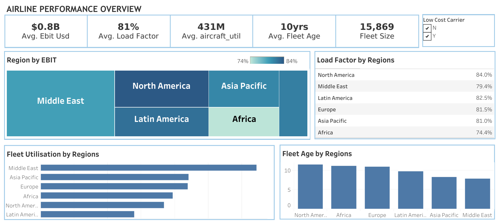

# ✈️ Airline Performance Analysis

This project explores the financial and operational performance of airlines across global regions (Africa, Asia Pacific, Europe, Latin America, Middle East and North America). The analysis focuses on comparing low-cost and non-low-cost carriers, as well as a comparative analysis to determine the region with the most efficient and profitable airlines.

## 🎯 Project Focus

- Compare performance metrics between low-cost and non-low-cost carriers.
- Analyze airline efficiency and profitability across different regions.
- Visualize Key Performance Indicators (KPIs) to highlight critical trends.

## 🔑 Relevance of the Project

- Profitability Optimization: Airlines need to understand the key drivers of profit across different carrier types to make informed decisions on pricing, fleet investment, and route planning.
- Operational Efficiency: Striking the right balance between load factor and passenger yield is critical for maximizing aircraft utilization without compromising revenue or overloading capacity.
- Regional Differences: Airlines operate under varied economic and regulatory conditions across regions, affecting fleet utilization and profitability, which in turn impacts local and national economies through aviation.
- Analyst Perspective: This project provides an opportunity to explore the aviation domain deeply, applying analytical skills to uncover business insights and effectively visualize key performance indicators that influence strategic decisions.

## 📂 Dataset & Problem Brief

The dataset used for this analysis contains key operational and financial variables that are critical in assessing airline performance across regions and carrier types. These metrics formed the foundation for evaluating profitability, efficiency, and market strategy.

- Key Columns Included:

  - EBIT in USD (ebit_usd) : Earnings Before Interest and Taxes, reported in USD.
  - Load Factor (load_factor) : Percentage of available seating capacity that is actually filled with paying passengers.
  - Number of Routes (num_routes) : Total number of flight routes operated by the airline, providing insight into market reach and network size.
  - Passenger Yield (passenger_yield) : Revenue per revenue passenger kilometer. Higher values indicate better revenue generation per unit distance.
  - Average Fleet Age (avg_fleet_age) : The average age of all aircraft in an airline’s fleet, which influences maintenance costs and efficiency.
  - Available Seat Kilometers (ask) : Total seat capacity multiplied by distance flown; a measure of total transport supply.
  - Fleet Size (fleet_size) : Number of aircraft in an airline’s fleet.
  - Fleet Utilization Proxy : Calculated as ASK / fleet_size to estimate how intensively the fleet is used.
  - Average Airline Age : Represents the maturity of the airline itself, which may correlate with experience, brand strength, or operational scale.

The dataset and original problem brief (including the guiding questions) were shared via Google Drive:  
🔗 [Access the source folder here](https://drive.google.com/drive/folders/1Rj4EFaMmmaAJqvD_fx-w8_juQbuyRx1I)

Special thanks to [Silvia Wutche](https://www.linkedin.com/in/silvia-wutche/) for making both the dataset and problem framing available for this analysis.

## 🧪 Methodology

This project followed a structured analytical workflow using Microsoft Excel, PostgreSQL, and Tableau:

- Microsoft Excel was used for initial dataset inspection. This included checking for:
  - Unique values in columns (e.g., 'Y' or 'N' in low_cost_carrier)
  - Null values and data types
  - Number of rows and columns
  - Quick insights using filter options (e.g., understanding which regions were represented)
    This step ensured proper schema design before importing the data into SQL.

- PostgreSQL was used for data transformation and exploratory analysis. Key actions included:
  - Creating and importing the dataset into a relational table
  - Aggregating performance metrics by airline type (low_cost_carrier) and by region
  - Deriving new metrics such as average aircraft utilization (ASK / fleet_size)
  - Investigating patterns in profitability and efficiency.

- Tableau was used for data visualization. The key performance indicators (KPIs) explored included:
  - Average EBIT (USD)
  - Load factor
  - Aircraft utilization
  - Fleet age and fleet size
  Visuals such as bar charts, treemaps, and text tables were used to bring out patterns and insights clearly.

## 📊 Key Insights

- **Non-low-cost carriers** generated higher average EBIT ($981M) than **low-cost carriers** ($284M). This suggests that a low-cost model may not always translate to higher profitability, prompting airlines to evaluate whether maintaining a low-cost strategy aligns with their financial goals and market positioning.  
- **Low-cost carriers** typically operate **newer fleets**, averaging 7.3 years compared to 11.4 years for non-low-cost airlines. The newer fleet age reflects the relatively recent emergence of low-cost carriers as a business model. This could explain their lower average earnings, as many are still in early growth phases compared to traditional carriers with established routes, customer bases, and infrastructure.
- **Low-cost carriers** recorded a slightly higher **average load factor** (84%) compared to **non–low-cost carriers** (81%). This means more people are flying with low-cost airlines because they are cheaper. This helps the airlines fill more seats, which means they can still make good money even if ticket prices are low.
- **Passenger yield** (revenue per km) was higher among non-low-cost carriers — $0.10/km vs $0.06/km. Non–low-cost carriers make more money per kilometer flown because they charge higher ticket prices. This explains why they can earn more overall, even with fewer passengers. 
- The **Middle East** outperformed other regions in revenue and aircraft utilization, with an average EBIT of $1.9B and efficient use of fleet resources showing how smart fleet usage can boost profits. This suggests that how a region manages its fleet can directly impact airline earnings.
- **Asia Pacific**, **Europe**, and **North America** had the most low-cost carriers, while **Africa** had none in the dataset — possibly pointing to market gaps or regulatory and infrastructure challenges in the region.

 ## 🔍 Sample SQL Queries
 Below are some of the key SQL queries used to extract and aggregate data that underpin the insights shared above

 ###  Identify Key Metrics for Low-Cost vs. Non-Low-Cost Airlines
 ```sql
SELECT
    low_cost_carrier,
    ROUND(AVG(ebit_usd), 2) AS avg_ebit_usd,
    ROUND(AVG(load_factor), 2) AS avg_load_factor,
    ROUND(AVG(num_routes), 2) AS avg_num_routes,
    ROUND(AVG(passenger_yield), 2) AS avg_passenger_yield,
    ROUND(AVG(avg_fleet_age), 2) AS avg_fleet_age
FROM airline_data
GROUP BY low_cost_carrier;
```

### Regional Performance Analysis of Airlines
```sql
SELECT
    region,
    ROUND(AVG(ebit_usd), 2) AS avg_ebit_usd,
    ROUND(AVG(load_factor), 2) AS avg_load_factor,
    ROUND(AVG(passenger_yield), 2) AS avg_passenger_yield,
    ROUND(AVG(ask * 1.0 / fleet_size), 2) AS avg_aircraft_utilisation,
    ROUND(AVG(airline_age), 2) AS avg_airline_age
FROM airline_data
GROUP BY region
ORDER BY avg_ebit_usd DESC;
```

📄 See full [SQL queries used to derive these insights](https://github.com/rwejoye/airline-performance-analysis/blob/main/airline_performance_analysis.sql).

## 📈 Tableau Dashboard



🔗 [View full dashboard on Tableau Public](https://public.tableau.com/app/profile/richmond.wejoye/viz/AirlinePerformanceOverview/ExecutiveSummary)


## 📌 Recommendations
- Airlines should prioritize fleet modernization to lower costs and improve efficiency.
- Low-cost carriers need strategies to boost revenue per passenger without losing affordability.
- Traditional carriers should optimize pricing to increase seat occupancy while maintaining yields.
- Africa’s aviation sector should explore attracting low-cost carriers to expand market access.
- Regions can adopt best practices from the Middle East’s high fleet utilization for better profitability.
- Continuous monitoring of key performance indicators is essential to inform strategic decisions.
